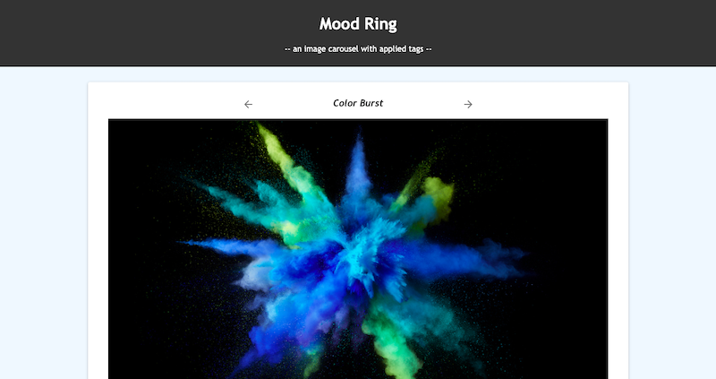

# Mood Ring

Mood Ring is a React-based image carousel, using Redux for client-side data storage and Redux Sagas for making requests to the server. The application allows the user to scroll backward and forward through a continuous loop of photos, see associated tags for each one, and add tags for each one. The application does not rely on any pre-built carousels.

## Built With

React, Redux, Node.js, Express.js, PostgreSQL, Material-UI

## Getting Started

These instructions will get you a copy of the project up and running on your local machine for development and testing purposes.

### Prerequisites

- [Node.js](https://nodejs.org/en/)
- [PostgresQL](https://www.postgresql.org/)
- [Postico](https://eggerapps.at/postico/)

### Installing

Steps to get the development environment running.

1. Download this project.
2. Set up a local PostgreSQL database called `saga_weekend`
3. Use the data.sql instructions to create a table in your database
4. In the terminal, `npm install` in the project folder
5. In the terminal, `npm run server` and `npm run client`

## Screen Shot

## Documentation

### Completed Features

App allows users to

- [x] Scroll backward and forward through all images
- [x] View all associated tags for each image
= [x] Add additional tags for each image

### Next Steps

- [ ] Add animation / transitions -- fade in/out, slide in, etc.
- [ ] Allow tag deletion
- [ ] Create a view that can pull statistics -- how many images have X tag, e.g.
- [ ] Add a form to add new tags and/or images
- [ ] Material UI -- Make it responsive (Grid)
- [ ] Material UI -- Give it a theme
- [ ] Deploy to Heroku

## Authors

* Thomas Roselyn

## Acknowledgments

* Prime Digital Academy